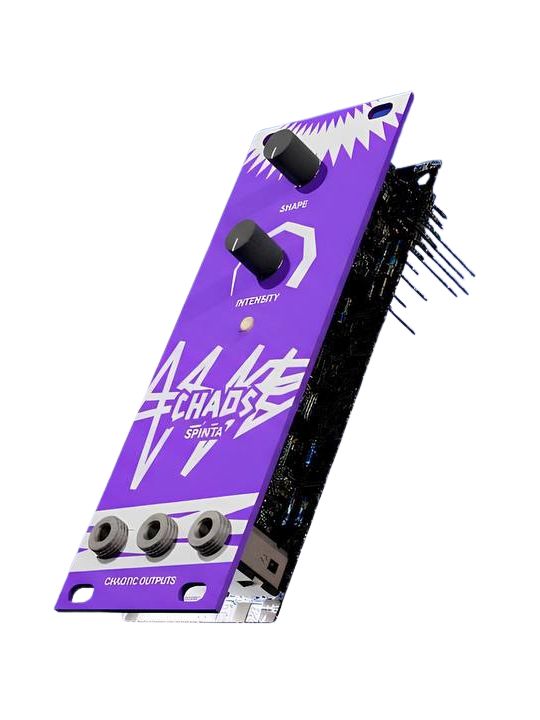

<h1 align="center">
	 
		
	 
		Khaos-V
	 
</h1>

<h4 align="center">Chaotic drone Eurorack module from PoliTeK.</h4>

---

> ## 🚧 Work In Progress
> This project is currently under active development.

Khaos-V is an experimental Eurorack module designed to explore the generation of chaotic control voltages using nonlinear mathematical models. Based on the “jerk” dynamical system, this fully analog prototype produces three distinct CV signals (x, y, z), exhibiting unpredictable yet deterministic behavior.

Two main controls allow interaction with the system dynamics: shape, which alters the structure of the chaotic attractor, and intensity, which adjusts its energy and voltage range. The three outputs enable simultaneous modulation of multiple parameters, introducing complex and organic variations.

Currently in a prototype stage, Chaos Spinta implements a single chaotic model. The final version will be a hybrid analog-digital design, allowing selection between multiple chaotic models, both analog and digital, significantly expanding its modulation capabilities.
